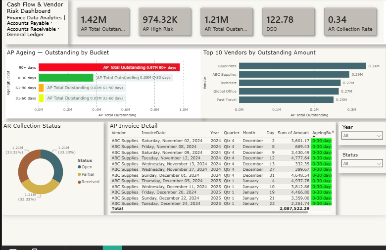
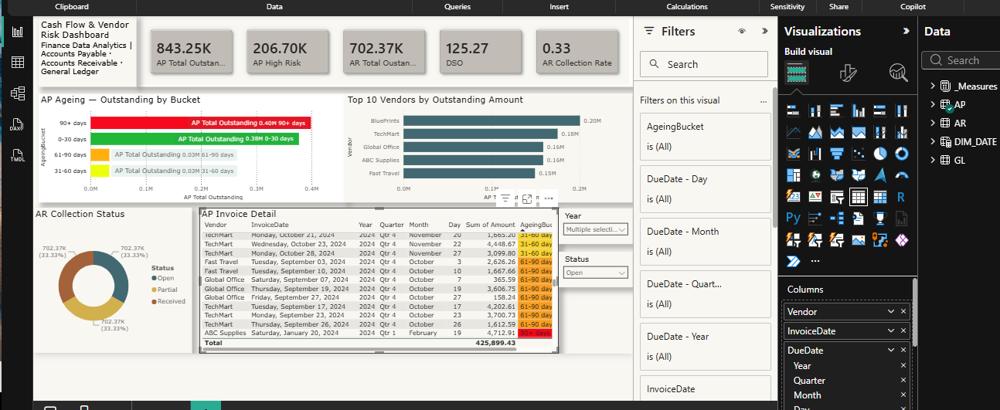

# Cash Flow & Vendor Risk Dashboard

**Tools:** Power BI · Power Query · DAX · Excel (ETL)
**Sources:** Accounts Payable · Accounts Receivable · General Ledger
**Skills demonstrated:** Multi-source ETL, star-schema modeling, financial KPIs in DAX, aging analysis, self-service dashboard design

---

## The Problem

Finance teams need to monitor three questions at once — *what do we owe, what are we owed, and where is the risk?* — but that information usually lives in three separate systems that don't talk to each other: Accounts Payable, Accounts Receivable, and the General Ledger.

This project integrates all three into a single interactive dashboard that lets a finance team monitor outstanding payments, vendor risk, and collection efficiency **without needing technical support** — simulating the data flow of a real ERP system.

> The core question: **Where is cash tied up, and which vendors and overdue invoices represent the most risk?**

---

## Research Questions

1. How do you integrate three independent financial sources (AP, AR, GL) into one coherent model without mixing what shouldn't be mixed?
2. How much is outstanding on both sides — payables and receivables — and how much of it is overdue?
3. Which aging bucket concentrates the most risk, and which vendors carry the largest exposure?
4. How efficiently is the business collecting what it's owed (DSO and collection rate)?
5. How should paid vs. unpaid invoices be handled so overdue risk is measured honestly?

---

## Approach

- **Kept the three sources as separate queries** in Power Query, mirroring the ERP's real architecture rather than flattening them together.
- **Built a star schema** with a central `DIM_DATE` table (created in DAX with `CALENDAR`, marked as a Date Table to enable time intelligence), related 1-to-many with single-direction filtering to AP, AR, and GL.
- **Engineered an aging analysis** — a `DaysOverdue` column measured against a fixed reference date (31/12/2024) rather than `TODAY()`, so the analysis stays stable and reproducible over time, plus an `AgeingBucket` column (0-30, 31-60, 61-90, 90+ days).
- **Handled paid invoices explicitly** — `DaysOverdue = null` and bucket = `N/A (Paid)` for anything not Open, so paid invoices never inflate the overdue figures.
- **Wrote 9 DAX measures** in a dedicated `_Measures` table, each tied to a clear business question (AP Outstanding, AP High Risk, AR Outstanding, DSO, Collection Rate, GL Net Balance, etc.).

---

## Dashboard



*Top row: KPI cards. Middle: AP aging and top-10 vendor exposure. Bottom: invoice detail with conditional formatting and slicers.*

---

## 5 Key Insights

**1. Risk is concentrated in the oldest aging bucket.**
The 90+ days bucket concentrates the largest share of outstanding payables. That concentration is the signal a finance team needs: the payment cycle has a tail of very old invoices that requires priority attention, not a spread-out, healthy aging profile.

**2. DSO exceeds the industry benchmark.**
Days Sales Outstanding — the average time to collect — runs above the standard 45-60 day benchmark. A high DSO means cash is tied up in receivables longer than it should be, which directly pressures operating cash flow.

**3. Vendor exposure is concentrated in a few names.**
The Top-10 vendor analysis shows outstanding debt concentrated with a small number of vendors. That's a dependency risk: a disruption with any one of them has an outsized effect, and it's invisible until you rank exposure by counterparty.

**4. Collection rate reveals process gaps.**
The share of invoiced amounts actually collected points to room for improvement in the receivables process — the gap between what's billed and what's collected is where working capital leaks.

**5. Separating paid from unpaid is what makes the risk number honest.**
By nulling out `DaysOverdue` for paid invoices and bucketing them as `N/A (Paid)`, the overdue figures reflect only genuinely open exposure. Without that step, paid invoices would dilute the aging analysis and understate the real risk — a small modeling decision with a large effect on trust.

---

## The Model

```
                 DIM_DATE
              /      |      \
          AP        AR        GL
    (payables) (receivables) (ledger)
```

`DIM_DATE` is the central dimension, related 1-to-many (single-direction) to all three fact tables on their transaction dates — enabling consistent time-based analysis across the whole model.

---

## Files in This Folder

| File | Description |
|------|-------------|
| `images/` | Dashboard screenshots |
| `Accounts-Payable.xlsx` | Payables source (~800 rows) |
| `Accounts-Receivable.xlsx` | Receivables source (~900 rows) |
| `General-Ledger.xlsx` | Ledger source (~2,000 rows) |

---

## What This Project Demonstrates

This project covers the full analytics cycle: extracting and cleaning multiple independent sources, modeling them into a star schema, engineering aging and risk logic, writing financial DAX measures, and designing an executive dashboard built for **self-service** — so a non-technical finance user can answer their own questions by filtering, instead of requesting a new report each time.
