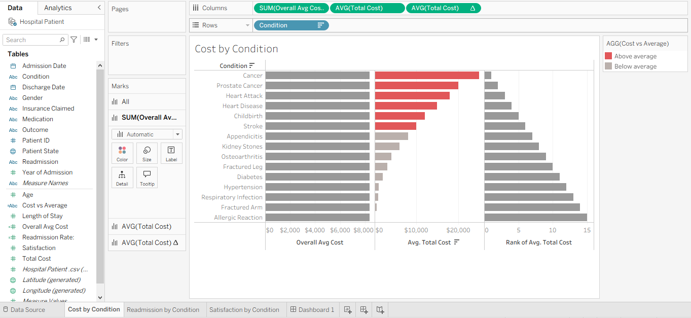

# Hospital Cost, Readmission & Satisfaction by Condition (Tableau)

**Tools:** Tableau · LOD Expressions · Table Calculations · Dashboard Actions
**Skills demonstrated:** Level-of-detail calculations, table calculations (rank), conditional formatting, interactive dashboard design, above/below-average benchmarking

---

## The Problem

A hospital wants to understand its patient records across three dimensions at once — **cost, readmission, and satisfaction** — broken down by medical condition. The goal is to see not just which conditions cost the most, but whether that cost is justified by outcomes, and where each condition stands relative to the overall average.

> The core question: **Which conditions cost more than average, and does that higher cost align with better outcomes or higher satisfaction?**

This is a value-analysis question: raw cost by condition is easy, but the insight comes from benchmarking each condition against the overall average and ranking them — which requires calculations that operate at a different level than the view itself.

---

## Research Questions

1. What is the average cost per condition, and how does each compare to the overall average across all conditions?
2. Which conditions are above average on cost, and which are below?
3. How do conditions rank against each other by cost?
4. Do the most expensive conditions also carry the highest readmission rates?
5. How does patient satisfaction vary across conditions?

---

## Approach

- **Used a FIXED LOD expression** to calculate the overall average cost independent of the view — `{FIXED : AVG([Total Cost])}` — so every condition could be benchmarked against a single, constant reference value regardless of how the view was filtered.
- **Built an above/below-average classifier** comparing each condition's average cost to that overall average, driving a red/grey conditional color so over-average conditions stand out instantly.
- **Applied a table calculation (Rank)** to order conditions by average cost — a calculation that operates on the aggregated data in the view.
- **Built a Readmission Rate calculated field** — converting a categorical Yes/No field into a true rate.
- **Wired dashboard actions** so selecting a condition in one worksheet filters the others, making the three views (cost, readmission, satisfaction) explore together as one interactive story.

---

## Dashboard

**Cost by condition — with above-average conditions highlighted:**

*Red bars are conditions above the overall average cost; grey are below. The FIXED LOD provides the constant benchmark line the classification depends on.*

---

## 5 Key Insights

**1. A handful of conditions sit clearly above the overall average cost.**
Using the FIXED LOD as a constant benchmark, conditions like the most serious diagnoses stand out in red as above-average, while routine conditions fall below. This separation is the first thing a value-management team looks for — where the money concentrates.

**2. Cost and readmission don't move together across all conditions.**
Ranking conditions by cost and comparing against readmission shows that the most expensive conditions are not always the ones with the highest readmission — a sign that high spend doesn't automatically buy better outcomes, which is exactly the mismatch worth investigating.

**3. Ranking makes the cost hierarchy explicit.**
The table-calculation rank turns a bar chart into an ordered list, so the single most expensive condition — and the cheapest — are unambiguous. Ranking is more decision-useful than raw bars when a team needs to prioritize.

**4. Satisfaction varies independently of cost.**
Patient satisfaction by condition doesn't track cost cleanly — some lower-cost conditions score well and some high-cost ones don't — reinforcing that cost, outcome, and experience are three separate axes that must be read together, not assumed to align.

**5. The interactivity turns three separate charts into one investigation.**
Because a dashboard action links the worksheets, selecting a condition filters cost, readmission, and satisfaction simultaneously — so a user can follow one condition across all three dimensions in a single click, rather than reading three disconnected charts.

---

## Tableau Techniques Used

| Technique | Where |
|-----------|-------|
| **FIXED LOD** | Overall average cost benchmark, independent of view |
| **Table calculation (Rank)** | Ordering conditions by average cost |
| **Calculated field (classifier)** | Above/below average cost flag driving color |
| **Calculated field (rate)** | Readmission rate from a Yes/No field |
| **Dashboard action** | Cross-filtering the three worksheets together |

---

## What This Project Demonstrates

This project shows command of Tableau's more advanced calculation layers — the distinction between **LOD expressions** (which compute before aggregation, at a level you define) and **table calculations** (which compute after aggregation, on the view) — plus the interactivity that turns separate charts into a single, explorable story. It's a value-analysis dashboard: not just what each condition costs, but how it compares, where it ranks, and whether cost aligns with outcome.
